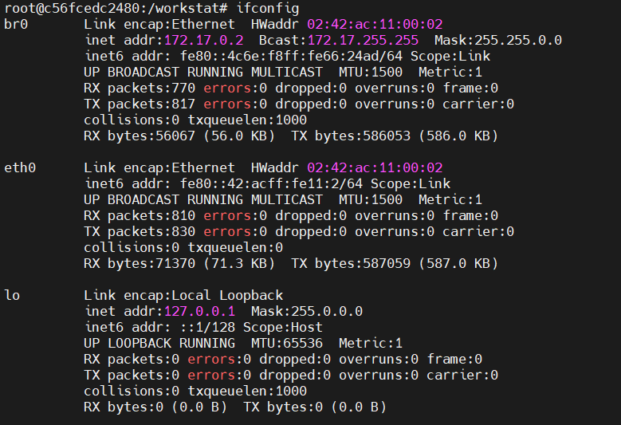
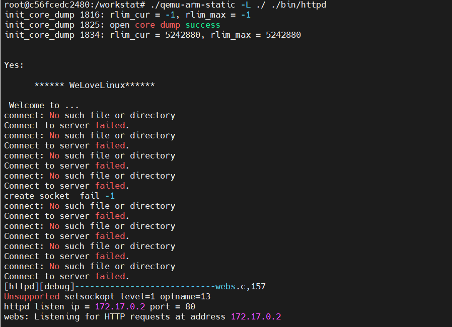
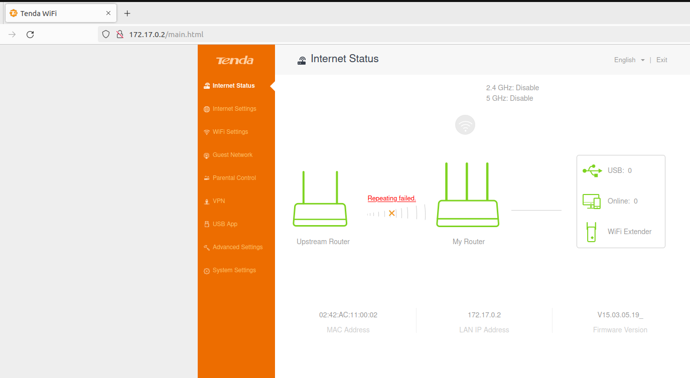

# 固件仿真容器化
- ubuntu22.04
## docker 容器构建
### docker 安装
```bash
sudo apt update
sudo apt install apt-transport-https ca-certificates curl software-properties-common -y
curl -fsSL https://download.docker.com/linux/ubuntu/gpg | sudo gpg --dearmor -o /usr/share/keyrings/docker-archive-keyring.gpg
echo "deb [arch=$(dpkg --print-architecture) signed-by=/usr/share/keyrings/docker-archive-keyring.gpg] https://download.docker.com/linux/ubuntu $(lsb_release -cs) stable" | sudo tee /etc/apt/sources.list.d/docker.list > /dev/null
sudo apt update
sudo apt install docker-ce -y
sudo systemctl status docker
sudo usermod -aG docker ${USER}
su - ${USER}

```
### qemu 用户态
- 编写 dockerfile
    ```dockerfile
    FROM ubuntu:16.04
    # 拷贝路由器文件系统及对应的 qemu 用户态程序

    COPY ./_US_AC15V1.0BR_V15.03.05.19_multi_TD01/ /workstat
    # 换源
    COPY ./sources.list /etc/apt/
    WORKDIR /workstat
    # 下载网络配置等所需工具
    RUN apt update \
        && apt install net-tools \
        && apt install bridge-utils -y \
        && apt-get install inetutils-ping -y \
        && apt install wget -y
    ```
- 构建 docker 容器
  ```bash
  docker build -t d_f:v1 . && docker run -it --privileged -p 127.0.0.1:8080:80 d_f:v1
  ```
- docker 内仿真环境配置
    ```bash
    brctl addbr br0
    ifconfig br0 172.17.0.2/16
    brctl addif br0 eth0 
    ip addr del 172.17.0.2/16 dev eth0
    ```
    
- 运行 qemu
  ```bash
  ./qemu-arm-static -L ./ ./bin/httpd
  ```
  
  


